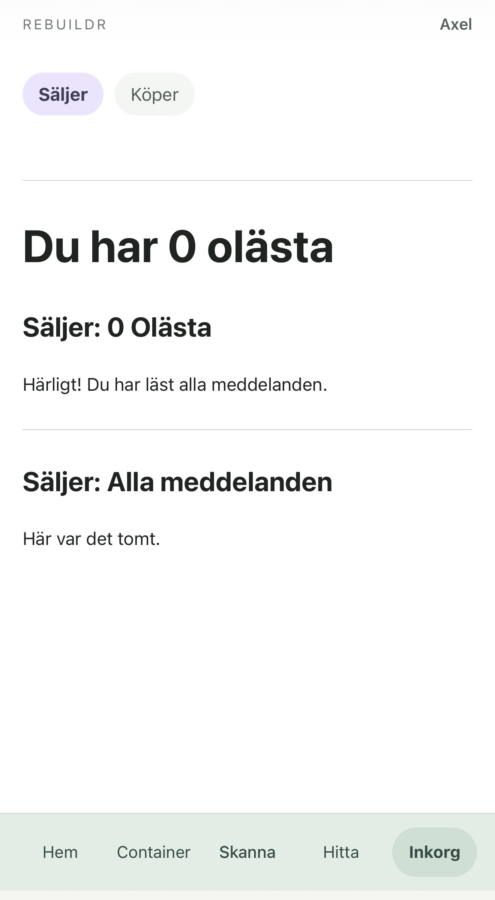
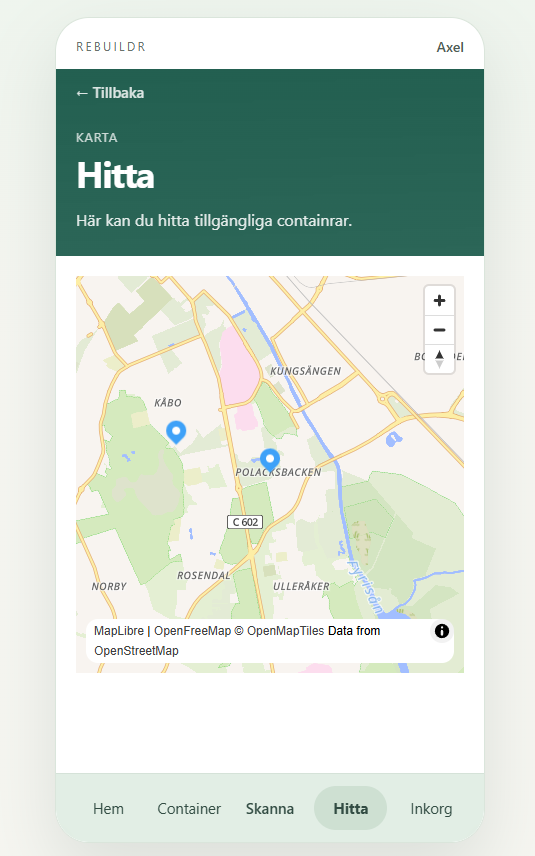
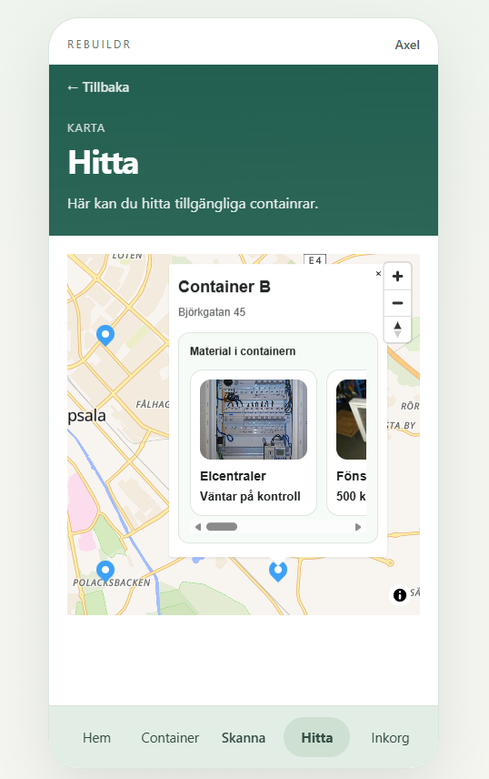

# RebuildR

RebuildR is a web platform designed to support construction material reuse through digital material banks and AI-assisted workflows.

## Technologies

* React
* TypeScript
* Vite
* Supabase
* Vercel

Features

* Container management
* Material tracking
* QR code scanning
* Interactive map view
* User authentication

## Screenshots

### Dashboard


### Container Management


### Map View


### Material Discovery


## Project Overview

The project explores how digital platforms can improve the reuse of construction materials by making materials easier to register, discover, and manage.

## My Contribution

As part of a collaborative development team, I contributed to the development of the web application using React and TypeScript. The project involved building user-facing functionality, collaborating through GitHub, and integrating cloud-based services through Supabase.

## Deployment

The application is deployed using Vercel and developed with a modern React and TypeScript stack.

## Installation

```bash
npm install
npm run dev
```

## Build

```bash
npm run build
```

## Project Structure

* docs/project-brief.md
* docs/webapp-start.md
* src/
